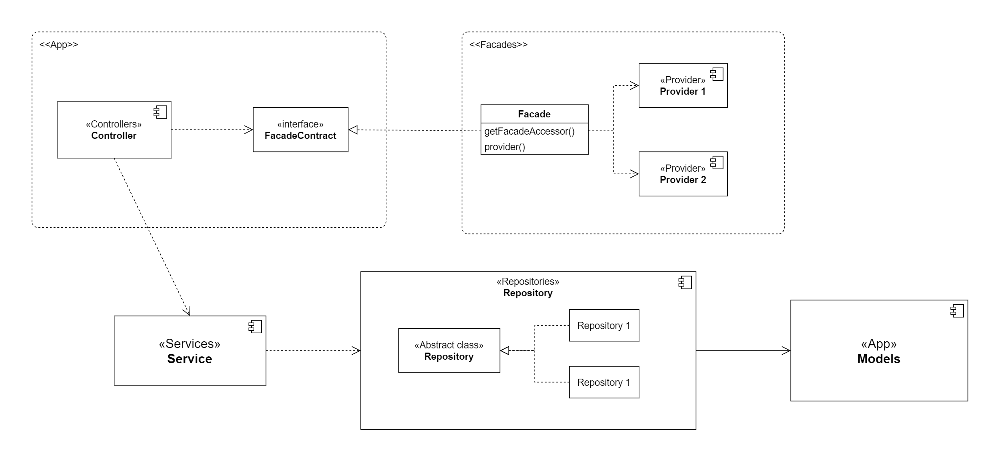
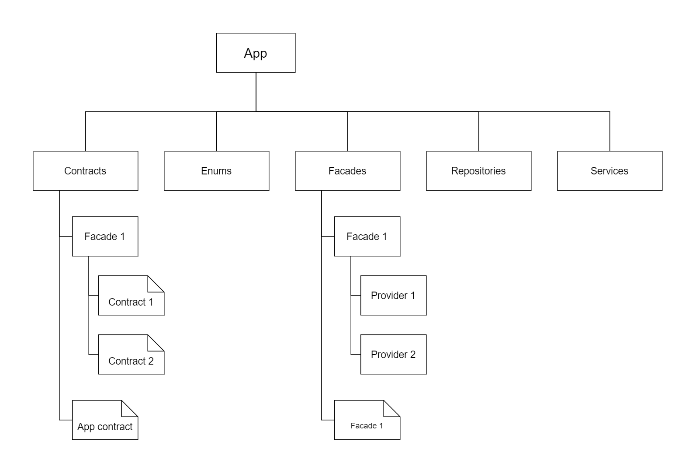

# Project: E-commerce Store - Sending Data to Courier Service

## Introduction

This project implements the logic for sending parcel data 
from an e-commerce store to a courier service (e.g., Nova Poshta). 
Laravel is used to create an API that accepts parcel 
and recipient data and sends it to the appropriate URL. 
The project is designed with future scalability 
and enhancements in mind.

## Scalability and Stability

For excellent scalability, facades are used, 
and to ensure stability, they are implemented through interfaces. 
Laravel facilitates this through the use of service providers, 
which allow for easy management and registration 
of these components, ensuring a clean and maintainable codebase.
## Architectural Diagrams

### General Architecture

### Directory Structure

## Testing

Two tests were implemented to ensure the proper functioning of the delivery request logic:

1. **Successful Request Test:** This test verifies that the delivery request is successfully sent and the response status is 200.

2. **Failed Request Test:** This test simulates a failed delivery request and ensures the response status is correctly handled.
